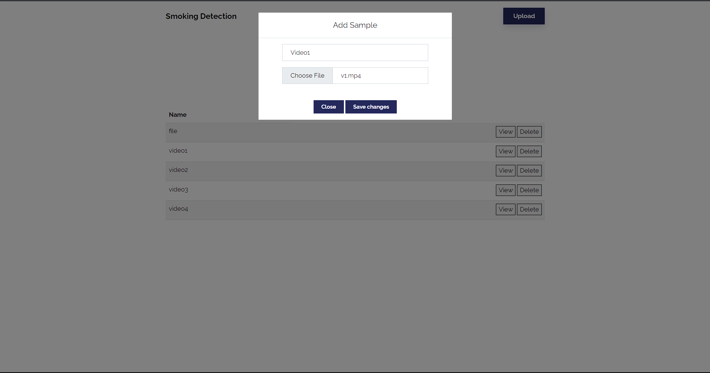

# Smoking Detection with YOLOv5

## Introduction

Cigarette smoking is a significant public health issue, responsible for numerous negative health consequences such as cancer, heart disease, and respiratory disease. Despite widespread knowledge of the dangers of smoking, it continues to be a common habit among many individuals. One potential approach to reduce smoking rates and mitigate its negative health effects is through the use of smoking detection models. Our project aimed to develop a cigarette smoking detection model using the YOLOv5 architecture. In this presentation, we will discuss our methodology, results, deployment, and conclusions regarding the development and evaluation of this model.

Object detection is a vital computer vision task that involves identifying and localizing objects within an image or video. This has many practical uses, including surveillance, robotics, and image and video analysis. Some popular object detection models include Faster R-CNN, YOLO, and SSD. YOLOv5 is a cutting-edge object detection model that uses a single neural network to detect objects in real-time. YOLOv5 employs EfficientNet architecture modifications, anchor-based detection, and a feature pyramid network to accurately detect objects of varying sizes and shapes. YOLOv5 has demonstrated impressive performance in detecting people, vehicles, and animals, among other objects. Its high accuracy and ability to detect objects in real-time make it ideal for applications such as surveillance, autonomous driving, and robotics.

## Why YOLOv5?

* YOLOv5 uses a deep convolutional neural network to detect objects in images or videos. It can detect objects of different sizes and aspect ratios with high accuracy and speed. YOLOv5 achieves this by using a single-stage detection framework that simultaneously predicts bounding boxes and class probabilities for each object.

* One of the key features of YOLOv5 is its architecture, which is based on a smaller and more efficient backbone network called CSPDarknet. This results in faster training and inference times compared to other state-of-the-art object detection models.

* Another advantage of YOLOv5 is its flexibility and ease of use. It comes with a user-friendly command-line interface that allows users to easily train and deploy their own object detection models. Additionally, it is compatible with multiple deep learning frameworks, including PyTorch, TensorFlow, and ONNX.

## The Dataset

The Dataset for this task was obtained from Kaggle, as this particular problem largely involves privacy matters and concerns. While the goal was to obtain data from real world scenarios, the dataset provides representation close to that of actual samples, with the object of target, a cigarette appearing at many different scales and sizes. 

Dataset link & Credit: https://www.kaggle.com/datasets/vitaminc/cigarette-smoker-detection

The split used:
* Training: 1400 images
* Validation: 300 images
* Testing: 296 images

The images were annotated in the YOLO format (.txt) using **labelimg**

## The Model

YOLOv5s is the smallest and fastest variant of the YOLOv5 family, which makes it suitable for real-time applications on low-end devices

The YOLOv5s model consists of a total of 87 layers, including 83 convolutional layers and 4 pooling layers. The model has a total of 7.6 million parameters.

Here's a breakdown of the layer types and parameters in YOLOv5s:

* Convolutional layers: 83
* Pooling layers: 4
* Batch normalization layers: 84
* Activation layers: 83
* Linear layers: 3

The number of parameters in each type of layer is as follows:

* Convolutional layers: 7.4 million
* Batch normalization layers: 166,656
* Linear layers: 40,864
The total number of parameters in the YOLOv5s model is therefore 7.6 million.

## Experimentations

The model was trained using the ultralytics implementation of YOLOv5, which makes it easier to train and deploy these models. Using the available training setup,
a total of 4 (Major and few minor ones, with small changes). (Note that the image size used was **(512X512)**) They are as follows:

* **Model 1**: First model, therefore the Baseline for this task. With standard setup, it was trained for 10 epochs with a batch size of 16  \
Result: It performed poorly, with a precision of 0.75542 and mAP@0.5 of 0.6785

* **Model 2**: For this run, the number of epochs were raised to 25 with batch size of 32, to give the model more examples at a time.  \
Result: It showed significant improvement, with a precision of 0.86214 and mAP@0.5 of 0.8467, but still failed to properly work while testing

* **Model 3**: Increase in epochs was a definite improvement, and so was the raise in batch size. Therefore, with the same setup, this model was trained for 50 epochs \
Result: It improved even further, with a precision of 0.9434 and mAP@0.5 of 0.93828, and also worked well with testing. But some other objects were also getting misclassified as a 'cigarette', this model still needed to learn more

* **Model 4**: The final run, with 100 epochs and batch size of 32. \
Result: A lot of the issues with earlier models were addressed with this one. There were certainly some misclassifications but overall it worked best. \
Precision: 0.9729 and mAP@0.5: 0.9714

## Deployment

The best model weights were obtained from the training process, and the inference engine was deployed on web application using Django backend framework with a simple UI

Advantages of Django:

* Highly scalable
* Secure
* Built-in Authentication
* Built-in ORM system
* Simple to integrate with frontend templates

### Features

* Upload Samples (Images/Videos) and store in the database  \
> This can directly take RTSP links as well, for real time detections using CCTV footages
* View Samples
* Run Model Inferences

  

  

  

### Follow these steps to run the server on localhost

* Clone Repository

`git clone <repo_url>`

This will setup the remote repository on your local machine

* Create Conda virtual environment

`conda create --name <env_name> python=3.9`

* Install requirements

`pip install -r requirements.txt` (Windows)  

`pip3 install -r requirements.txt` (MacOS/Linux)

* Create migrations to database

`python manage.py makemigrations`

`python manage.py migrate`

This will create the tables in the Database. (Use `python3` for MacOS/Linux)

* Run local server

`python manage.py runserver:8000`

NOTE: Ensure port 8000 is not being used by any other service

